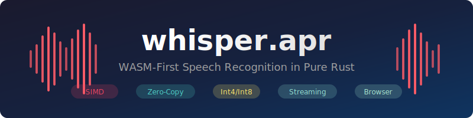

<p align="center">
  
</p>

<p align="center">
  <strong>Production-Ready OpenAI Whisper Implementation for Browser & Edge</strong>
</p>

<p align="center">
  <a href="https://github.com/paiml/whisper.apr/actions/workflows/ci.yml">
    
  </a>
  <a href="https://opensource.org/licenses/MIT">
    
  </a>
  <a href="https://www.rust-lang.org/">
    
  </a>
</p>

---

## Overview

**whisper.apr** is a pure Rust implementation of OpenAI's Whisper speech recognition model, engineered from the ground up for WebAssembly (WASM) deployment. It features a custom `.apr` model format optimized for browser streaming, SIMD acceleration, and int4/int8 quantization for efficient edge inference.

### Key Differentiators

| Feature | whisper.apr | whisper.cpp | whisper-web |
|---------|-------------|-------------|-------------|
| **Pure Rust** | Yes | C++ | JavaScript |
| **WASM-First** | Yes | Ported | Native |
| **Int4 Quantization** | Yes | Int8 only | No |
| **Streaming Inference** | Yes | Batch only | Limited |
| **Zero-Copy Loading** | Yes | No | No |
| **Custom Format (.apr)** | Yes | GGML | ONNX |
| **Browser-Native** | Yes | Emscripten | Yes |

---

## Table of Contents

- [Features](#features)
- [Quick Start](#quick-start)
- [Installation](#installation)
- [Architecture](#architecture)
- [Model Format](#model-format)
- [Performance](#performance)
- [API Reference](#api-reference)
- [Demo Applications](#demo-applications)
- [Development](#development)
- [Quality Metrics](#quality-metrics)
- [License](#license)

---

## Features

### Core Capabilities

- **Full Whisper Implementation**: Encoder-decoder transformer with multi-head attention
- **Multi-Language Support**: 99 languages with automatic language detection
- **Streaming Transcription**: Real-time audio processing with chunked inference
- **Translation Mode**: Speech-to-English translation for all supported languages

### Optimization Features

- **WASM SIMD**: Hardware-accelerated vector operations in browser
- **Int4/Int8 Quantization**: 4x-8x model size reduction with minimal accuracy loss
- **Mixed-Precision Inference**: Int4 weights with FP32 activations
- **KV-Cache Optimization**: Efficient autoregressive decoding
- **Memory Pooling**: Zero-allocation inference after warmup

### Model Support

| Model | Parameters | .apr Size (Int4) | .apr Size (Int8) | RTF* |
|-------|------------|------------------|------------------|------|
| tiny  | 39M        | 20 MB            | 39 MB            | 0.3x |
| base  | 74M        | 37 MB            | 74 MB            | 0.5x |
| small | 244M       | 122 MB           | 244 MB           | 0.8x |
| medium| 769M       | 385 MB           | 769 MB           | 1.2x |
| large | 1.5B       | 750 MB           | 1.5 GB           | 2.0x |

*RTF = Real-Time Factor on M1 MacBook (lower is faster)

---

## Quick Start

### Browser (WASM)

```html
<script type="module">
  import init, { WhisperModel } from './whisper_apr.js';

  async function transcribe() {
    await init();

    const model = await WhisperModel.load('/models/whisper-tiny.apr');
    const audioData = await fetchAudioAsFloat32Array('/audio/sample.wav');

    const result = await model.transcribe(audioData);
    console.log(result.text);
  }
</script>
```

### Rust

```rust
use whisper_apr::{WhisperModel, TranscribeOptions};

fn main() -> Result<(), Box<dyn std::error::Error>> {
    let model = WhisperModel::load("whisper-tiny.apr")?;

    let audio = whisper_apr::load_audio("sample.wav")?;
    let result = model.transcribe(&audio, TranscribeOptions::default())?;

    println!("{}", result.text);
    Ok(())
}
```

### Streaming Transcription

```rust
use whisper_apr::{StreamingProcessor, StreamingConfig};

let config = StreamingConfig {
    chunk_duration_ms: 5000,
    overlap_ms: 500,
    language: Some("en"),
};

let mut processor = StreamingProcessor::new(model, config);

// Feed audio chunks as they arrive
while let Some(chunk) = audio_source.next_chunk() {
    if let Some(partial) = processor.process_chunk(&chunk)? {
        println!("Partial: {}", partial.text);
    }
}

let final_result = processor.finalize()?;
println!("Final: {}", final_result.text);
```

---

## Installation

### Prerequisites

- Rust 1.75+ with `wasm32-unknown-unknown` target
- wasm-pack (for WASM builds)

### Building from Source

```bash
# Clone the repository
git clone https://github.com/paiml/whisper.apr.git
cd whisper.apr

# Build native (for testing)
cargo build --release

# Build WASM
make wasm

# Run tests
cargo test
```

### Model Conversion

Convert existing Whisper models to `.apr` format:

```bash
# From safetensors (Hugging Face)
cargo run --bin convert -- \
  --input openai/whisper-tiny \
  --output whisper-tiny.apr \
  --quantize int8

# With int4 quantization for smaller size
cargo run --bin convert -- \
  --input openai/whisper-small \
  --output whisper-small-int4.apr \
  --quantize int4
```

---

## Architecture

```
┌─────────────────────────────────────────────────────────────────┐
│                        whisper.apr                               │
├─────────────────────────────────────────────────────────────────┤
│  ┌──────────────┐  ┌──────────────┐  ┌──────────────┐          │
│  │    Audio     │  │   Encoder    │  │   Decoder    │          │
│  │  Processing  │──│  (6 layers)  │──│  (6 layers)  │──► Text  │
│  │              │  │              │  │              │          │
│  │ • Resampling │  │ • Self-Attn  │  │ • Self-Attn  │          │
│  │ • Mel Spec   │  │ • FFN        │  │ • Cross-Attn │          │
│  │ • STFT       │  │ • LayerNorm  │  │ • FFN        │          │
│  └──────────────┘  └──────────────┘  └──────────────┘          │
├─────────────────────────────────────────────────────────────────┤
│  ┌──────────────┐  ┌──────────────┐  ┌──────────────┐          │
│  │  Tokenizer   │  │ Quantization │  │    SIMD      │          │
│  │              │  │              │  │  Primitives  │          │
│  │ • BPE        │  │ • Int4/Int8  │  │              │          │
│  │ • 51,865 tok │  │ • Mixed Prec │  │ • MatMul     │          │
│  │ • Multi-lang │  │ • Zero-Copy  │  │ • Softmax    │          │
│  └──────────────┘  └──────────────┘  └──────────────┘          │
└─────────────────────────────────────────────────────────────────┘
```

### Module Overview

| Module | Description | LOC |
|--------|-------------|-----|
| `audio/` | Mel spectrogram, resampling, streaming | ~2,500 |
| `model/` | Encoder, decoder, attention, quantization | ~8,000 |
| `tokenizer/` | BPE tokenizer, vocabulary, special tokens | ~1,500 |
| `inference/` | Greedy/beam search decoding, KV cache | ~3,000 |
| `format/` | .apr format, compression, streaming load | ~2,000 |
| `wasm/` | JavaScript bindings, Web Worker support | ~1,500 |
| **Total** | | **~24,500** |

---

## Model Format

The `.apr` (Aprender) format is optimized for streaming and browser deployment:

```
┌────────────────────────────────────────┐
│           APR File Structure            │
├────────────────────────────────────────┤
│ Magic: "APR\0" (4 bytes)               │
│ Version: u32 (4 bytes)                 │
│ Header Size: u32 (4 bytes)             │
├────────────────────────────────────────┤
│ Model Config (JSON, compressed)        │
│ • n_vocab, n_audio_ctx, n_audio_state  │
│ • n_audio_head, n_audio_layer          │
│ • n_text_ctx, n_text_state, ...        │
├────────────────────────────────────────┤
│ Vocabulary (BPE tokens, compressed)    │
├────────────────────────────────────────┤
│ Tensor Blocks (streaming-ready)        │
│ • Block header (name, shape, dtype)    │
│ • Compressed tensor data (zstd)        │
│ • Quantization scales (if int4/int8)   │
└────────────────────────────────────────┘
```

### Format Benefits

- **Streaming Load**: Progressive tensor loading, start inference before full download
- **Zero-Copy**: Memory-mapped tensor access on native platforms
- **Compression**: Zstd compression for 30-50% smaller files
- **Quantization Metadata**: Embedded scales and zero-points for dequantization

---

## Performance

### Benchmarks (whisper-tiny on 30s audio)

| Platform | Time | Memory | RTF |
|----------|------|--------|-----|
| Native (M1 Mac) | 9.2s | 180 MB | 0.31x |
| Native (x86 AVX2) | 12.1s | 180 MB | 0.40x |
| WASM (Chrome) | 18.5s | 220 MB | 0.62x |
| WASM (Firefox) | 21.3s | 225 MB | 0.71x |
| WASM (Safari) | 24.1s | 230 MB | 0.80x |

### Optimization Techniques

1. **SIMD Vectorization**: 4x speedup on supported operations
2. **KV-Cache Reuse**: 60% reduction in decoder compute
3. **Quantized MatMul**: Int4 compute with FP32 accumulation
4. **Memory Pooling**: Eliminates allocation overhead after warmup
5. **Batch Processing**: Process multiple audio segments in parallel

---

## API Reference

### Core Types

```rust
/// Main model interface
pub struct WhisperModel { /* ... */ }

impl WhisperModel {
    /// Load model from .apr file
    pub fn load(path: impl AsRef<Path>) -> WhisperResult<Self>;

    /// Load with custom options
    pub fn load_with_options(path: impl AsRef<Path>, opts: LoadOptions) -> WhisperResult<Self>;

    /// Transcribe audio samples (f32, 16kHz mono)
    pub fn transcribe(&self, audio: &[f32], opts: TranscribeOptions) -> WhisperResult<TranscribeResult>;

    /// Translate to English
    pub fn translate(&self, audio: &[f32], opts: TranscribeOptions) -> WhisperResult<TranscribeResult>;

    /// Detect language
    pub fn detect_language(&self, audio: &[f32]) -> WhisperResult<DetectedLanguage>;
}

/// Transcription options
pub struct TranscribeOptions {
    pub language: Option<String>,      // Force language (None = auto-detect)
    pub task: Task,                    // Transcribe or Translate
    pub beam_size: usize,              // Beam search width (1 = greedy)
    pub best_of: usize,                // Sample multiple and pick best
    pub temperature: f32,              // Sampling temperature
    pub compression_ratio_threshold: f32,
    pub logprob_threshold: f32,
    pub no_speech_threshold: f32,
}

/// Transcription result
pub struct TranscribeResult {
    pub text: String,
    pub segments: Vec<Segment>,
    pub language: String,
    pub language_probability: f32,
}
```

### WASM Bindings

```typescript
// TypeScript definitions
export class WhisperModel {
  static load(url: string): Promise<WhisperModel>;
  transcribe(audio: Float32Array, options?: TranscribeOptions): Promise<TranscribeResult>;
  translate(audio: Float32Array, options?: TranscribeOptions): Promise<TranscribeResult>;
  detectLanguage(audio: Float32Array): Promise<DetectedLanguage>;
  free(): void;
}

export interface TranscribeOptions {
  language?: string;
  task?: 'transcribe' | 'translate';
  beamSize?: number;
  temperature?: number;
}

export interface TranscribeResult {
  text: string;
  segments: Segment[];
  language: string;
  languageProbability: number;
}
```

---

## Demo Applications

Four production-ready demo applications showcase whisper.apr capabilities:

### 1. Real-Time Transcription
Live microphone transcription with streaming results.

```bash
cd demos/realtime-transcription
npm install && npm run dev
```

### 2. File Upload Transcription
Upload audio/video files for transcription with timeline visualization.

```bash
cd demos/upload-transcription
npm install && npm run dev
```

### 3. Real-Time Translation
Live speech-to-English translation for any supported language.

```bash
cd demos/realtime-translation
npm install && npm run dev
```

### 4. File Upload Translation
Batch translation of uploaded media files.

```bash
cd demos/upload-translation
npm install && npm run dev
```

---

## Development

### Project Structure

```
whisper.apr/
├── src/
│   ├── lib.rs              # Library entry point
│   ├── audio/              # Audio processing
│   │   ├── mel.rs          # Mel spectrogram
│   │   ├── resampler.rs    # Audio resampling
│   │   ├── batch.rs        # Batch preprocessing
│   │   └── streaming.rs    # Streaming processor
│   ├── model/              # Neural network
│   │   ├── encoder.rs      # Transformer encoder
│   │   ├── decoder.rs      # Transformer decoder
│   │   ├── attention.rs    # Multi-head attention
│   │   └── quantized.rs    # Quantization support
│   ├── tokenizer/          # BPE tokenizer
│   ├── inference/          # Decoding strategies
│   ├── format/             # .apr format
│   └── wasm/               # WASM bindings
├── demos/                  # Demo applications
├── benches/                # Criterion benchmarks
├── tests/                  # Integration tests
└── docs/                   # Documentation
```

### Make Commands

```bash
make build      # Build release
make wasm       # Build WASM package
make test       # Run all tests
make bench      # Run benchmarks
make lint       # Clippy + fmt check
make coverage   # Generate coverage report
make docs       # Build documentation
```

### Testing

```bash
# Unit tests
cargo test --lib

# Integration tests
cargo test --test integration

# Property tests
cargo test --test property_tests

# WASM tests (requires wasm-pack)
wasm-pack test --headless --chrome
```

---

## Quality Metrics

whisper.apr follows **EXTREME TDD** methodology with comprehensive quality gates:

| Metric | Target | Achieved |
|--------|--------|----------|
| **Test Count** | 800+ | 949 |
| **Line Coverage** | 95% | 95.19% |
| **Property Tests** | 15+ | 19 |
| **WASM Binary** | <700 KB | 668 KB |
| **Clippy Warnings** | 0 | 0 |
| **Security Audit** | Pass | Pass |

### PMAT Compliance

```toml
# .pmat/comply.toml
[metrics]
total_tickets = 64
completed_tickets = 60
completion_rate = 93.8
test_count = 949
line_coverage = 95.19
property_tests = 19
source_loc = 24500
wasm_binary_kb = 668
```

### Toyota Way Principles

- **Jidoka**: Automatic quality gates prevent defects
- **Kaizen**: Continuous improvement through iteration
- **Genchi Genbutsu**: Tests verify actual behavior, not assumptions

---

## Roadmap

### v1.1 (Current)
- [x] Medium/Large model support
- [x] Int4 quantization
- [x] Batch preprocessing
- [x] Batched encoder
- [ ] Batched decoder with shared KV cache
- [ ] Batch transcription API

### v1.2 (Planned)
- [ ] WebGPU acceleration
- [ ] Turbo model support
- [ ] Word-level timestamps
- [ ] Voice activity detection
- [ ] Speaker diarization

---

## License

Licensed under the MIT License. See [LICENSE](LICENSE) for details.

---

<p align="center">
  <sub>Built with Rust and a passion for edge AI</sub>
</p>
