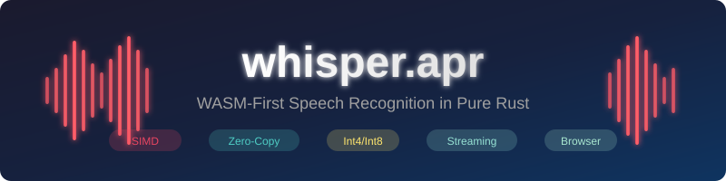

<p align="center">
  
</p>

<p align="center">
  <strong>Production-Ready OpenAI Whisper Implementation for Browser & Edge</strong>
</p>

<p align="center">
  <a href="https://crates.io/crates/whisper-apr">
    
  </a>
  <a href="https://docs.rs/whisper-apr">
    
  </a>
  <a href="https://opensource.org/licenses/MIT">
    
  </a>
  <a href="https://www.rust-lang.org/">
    
  </a>
</p>

---

## Overview

**whisper.apr** is a pure Rust implementation of OpenAI's Whisper speech recognition model, engineered from the ground up for WebAssembly (WASM) deployment. It features a custom `.apr` model format optimized for browser streaming, SIMD acceleration via trueno, and int4/int8 quantization for efficient edge inference. Also supports Moonshine ASR models and direct GGUF model loading.

### Key Differentiators

| Feature | whisper.apr | whisper.cpp | whisper-web |
|---------|-------------|-------------|-------------|
| **Pure Rust** | Yes | C++ | JavaScript |
| **WASM-First** | Yes | Ported | Native |
| **Int4 Quantization** | Yes | Int8 only | No |
| **Streaming Inference** | Yes | Batch only | Limited |
| **Zero-Copy Loading** | Yes | No | No |
| **Custom Format (.apr)** | Yes | GGML | ONNX |
| **GGUF Loading** | Yes | Native | No |
| **Moonshine Support** | Yes | No | No |
| **Browser-Native** | Yes | Emscripten | Yes |

---

## Table of Contents

- [Features](#features)
- [Usage](#usage)
- [Installation](#installation)
- [Architecture](#architecture)
- [Model Format](#model-format)
- [Performance](#performance)
- [API Reference](#api-reference)
- [CLI](#cli)
- [Demo Applications](#demo-applications)
- [Running Examples](#running-examples)
- [Development](#development)
- [Quality Metrics](#quality-metrics)
- [Contributing](#contributing)
- [Roadmap](#roadmap)
- [License](#license)

---

## Features

### Core Capabilities

- **Full Whisper Implementation**: Encoder-decoder transformer with multi-head attention
- **Moonshine ASR**: Lightweight alternative with GQA decoder and ConvStem encoder
- **Multi-Language Support**: 99 languages with automatic language detection
- **Streaming Transcription**: Real-time audio processing with chunked inference
- **Translation Mode**: Speech-to-English translation for all supported languages
- **Multi-Format Audio**: MP3, FLAC, OGG, AAC, M4A, WAV via symphonia

### Optimization Features

- **WASM SIMD**: Hardware-accelerated vector operations in browser
- **Int4/Int8 Quantization**: 4x-8x model size reduction with minimal accuracy loss
- **Mixed-Precision Inference**: Int4 weights with FP32 activations
- **KV-Cache Optimization**: Efficient autoregressive decoding
- **Tiled MatVec**: 3.5x single-token decoding speedup
- **Memory Pooling**: Zero-allocation inference after warmup

### Model Support

| Model | Parameters | Type | .apr Size (Int8) | Notes |
|-------|------------|------|------------------|-------|
| tiny | 39M | Whisper | 39 MB | Fastest, English-focused |
| base | 74M | Whisper | 74 MB | Good balance |
| small | 244M | Whisper | 244 MB | High accuracy |
| large-v3-turbo | 809M | Whisper | ~800 MB | 32 enc + 4 dec layers |
| large | 1.5B | Whisper | 1.5 GB | Highest accuracy |
| moonshine-tiny | 27M | Moonshine | 27 MB | Ultra-lightweight |
| moonshine-base | 61M | Moonshine | 61 MB | Lightweight alternative |

### Model Formats

| Format | Support | Notes |
|--------|---------|-------|
| **.apr** | Native | Optimized for WASM streaming |
| **.gguf** | Direct load | Pre-quantized from HuggingFace |
| **SafeTensors** | Convert to .apr | Via built-in converter |

---

## Usage

### CLI Transcription

```bash
# Install
cargo install whisper-apr --features cli

# Transcribe audio (auto-downloads model)
whisper-apr transcribe -f audio.wav

# Use specific model
whisper-apr transcribe -f audio.wav --model base

# Boost domain vocabulary (safe with all model sizes)
whisper-apr transcribe -f audio.wav --hotwords "Terraform,Ansible,Kubernetes"

# Use Moonshine model
whisper-apr transcribe -f audio.wav --model moonshine-tiny

# Load GGUF model directly
whisper-apr transcribe -f audio.wav --model-path whisper-tiny.gguf

# Transcribe MP3/FLAC/OGG/M4A (auto-detected)
whisper-apr transcribe -f podcast.mp3
```

### Browser (WASM)

```html
<script type="module">
  import init, { WhisperModel } from './whisper_apr.js';

  async function transcribe() {
    await init();

    const model = await WhisperModel.load('/models/whisper-tiny.apr');
    const audioData = await fetchAudioAsFloat32Array('/audio/sample.wav');

    const result = await model.transcribe(audioData);
    console.log(result.text);
  }
</script>
```

### Rust Library

```rust
use whisper_apr::{WhisperModel, TranscribeOptions};

fn main() -> Result<(), Box<dyn std::error::Error>> {
    let model = WhisperModel::load("whisper-tiny.apr")?;

    let audio = whisper_apr::load_audio("sample.wav")?;
    let result = model.transcribe(&audio, TranscribeOptions::default())?;

    println!("{}", result.text);
    Ok(())
}
```

### Streaming Transcription

```rust
use whisper_apr::{StreamingProcessor, StreamingConfig};

let config = StreamingConfig {
    chunk_duration_ms: 5000,
    overlap_ms: 500,
    language: Some("en"),
};

let mut processor = StreamingProcessor::new(model, config);

// Feed audio chunks as they arrive
while let Some(chunk) = audio_source.next_chunk() {
    if let Some(partial) = processor.process_chunk(&chunk)? {
        println!("Partial: {}", partial.text);
    }
}

let final_result = processor.finalize()?;
println!("Final: {}", final_result.text);
```

---

## Installation

### Prerequisites

- Rust 1.75+ with `wasm32-unknown-unknown` target
- wasm-pack (for WASM builds)

### From crates.io

```bash
# Library dependency
cargo add whisper-apr

# CLI tool
cargo install whisper-apr --features cli
```

### Building from Source

```bash
# Clone the repository
git clone https://github.com/paiml/whisper.apr.git
cd whisper.apr

# Build native (for testing)
cargo build --release

# Build WASM
make wasm

# Run tests
cargo test
```

### Model Conversion

Convert existing Whisper models to `.apr` format:

```bash
# From HuggingFace SafeTensors (auto-downloads)
cargo run --bin whisper-convert --features converter -- \
  --model tiny --output whisper-tiny.apr

# Or load GGUF models directly (no conversion needed)
whisper-apr transcribe -f audio.wav --model-path whisper-tiny.gguf
```

---

## Architecture

```
┌─────────────────────────────────────────────────────────────────┐
│                        whisper.apr                               │
├─────────────────────────────────────────────────────────────────┤
│  ┌──────────────┐  ┌──────────────┐  ┌──────────────┐          │
│  │    Audio     │  │   Encoder    │  │   Decoder    │          │
│  │  Processing  │──│  Transformer │──│  Transformer │──► Text  │
│  │              │  │              │  │              │          │
│  │ • Resampling │  │ • Self-Attn  │  │ • Self-Attn  │          │
│  │ • Mel Spec   │  │ • FFN        │  │ • Cross-Attn │          │
│  │ • Symphonia  │  │ • LayerNorm  │  │ • FFN / GQA  │          │
│  └──────────────┘  └──────────────┘  └──────────────┘          │
├─────────────────────────────────────────────────────────────────┤
│  ┌──────────────┐  ┌──────────────┐  ┌──────────────┐          │
│  │  Tokenizer   │  │ Quantization │  │    SIMD      │          │
│  │              │  │              │  │  (trueno)    │          │
│  │ • BPE        │  │ • Int4/Int8  │  │              │          │
│  │ • 51,865 tok │  │ • Mixed Prec │  │ • MatMul     │          │
│  │ • Multi-lang │  │ • GGUF Q4-Q6 │  │ • Softmax    │          │
│  └──────────────┘  └──────────────┘  └──────────────┘          │
└─────────────────────────────────────────────────────────────────┘
```

### Supported Model Architectures

| Architecture | Models | Decoder | Key Difference |
|-------------|--------|---------|----------------|
| **Whisper** | tiny, base, small, medium, large, large-v3-turbo | MHA + Cross-Attention | Standard encoder-decoder |
| **Moonshine** | moonshine-tiny, moonshine-base | GQA + Cross-Attention | ConvStem encoder, lighter |

### Module Overview

| Module | Description |
|--------|-------------|
| `audio/` | Mel spectrogram, resampling, symphonia decoding, streaming |
| `model/` | Whisper encoder/decoder, attention, quantization |
| `model/lfm2/` | Moonshine GQA decoder with RoPE |
| `wasm/` | JavaScript bindings, Web Worker support |
| `format/` | .apr format, GGUF loader, compression, streaming load |
| `inference/` | Greedy/beam search decoding, KV cache |
| `tokenizer/` | BPE tokenizer, vocabulary, 99-language support |
| `detection/` | Automatic language detection |
| `cli/` | Command-line interface and model management |

---

## Model Format

### .apr Format

The `.apr` (Aprender) format is optimized for streaming and browser deployment:

```
┌────────────────────────────────────────┐
│           APR File Structure            │
├────────────────────────────────────────┤
│ Magic: "APR\0" (4 bytes)               │
│ Version: u32 (4 bytes)                 │
│ Header Size: u32 (4 bytes)             │
├────────────────────────────────────────┤
│ Model Config (JSON, compressed)        │
│ • n_vocab, n_audio_ctx, n_audio_state  │
│ • n_audio_head, n_audio_layer          │
│ • n_text_ctx, n_text_state, ...        │
├────────────────────────────────────────┤
│ Vocabulary (BPE tokens, compressed)    │
├────────────────────────────────────────┤
│ Tensor Blocks (streaming-ready)        │
│ • Block header (name, shape, dtype)    │
│ • Compressed tensor data (zstd)        │
│ • Quantization scales (if int4/int8)   │
└────────────────────────────────────────┘
```

### GGUF Format (Direct Loading)

whisper.apr can load pre-quantized GGUF models from HuggingFace directly:

- Automatic tensor name remapping (whisper.cpp names to internal names)
- Model config inference from tensor shapes
- Supports Q4_0 through Q6_K, F16, and F32 quantization levels
- No conversion step needed

### Format Comparison

| Feature | .apr | GGUF | SafeTensors |
|---------|------|------|-------------|
| Streaming load | Yes | No | No |
| Browser-optimized | Yes | No | No |
| Pre-quantized | Yes | Yes | No |
| Direct loading | Yes | Yes | Convert needed |
| Compression | Zstd | None | None |

---

## Performance

### Runtime Benchmarks (whisper-tiny on 30s audio)

| Platform | Time | Memory | RTF |
|----------|------|--------|-----|
| Native (M1 Mac) | 9.2s | 180 MB | 0.31x |
| Native (x86 AVX2) | 12.1s | 180 MB | 0.40x |
| WASM (Chrome) | 18.5s | 220 MB | 0.62x |
| WASM (Firefox) | 21.3s | 225 MB | 0.71x |

### Key Optimizations

1. **Tiled MatVec**: 3.5x speedup for single-token decoding via fast path in matmul_raw
2. **SIMD Vectorization**: 4x speedup on supported operations via trueno
3. **KV-Cache Reuse**: 60% reduction in decoder compute
4. **Quantized MatMul**: Int4 compute with FP32 accumulation
5. **Memory Pooling**: Eliminates allocation overhead after warmup

### Performance Targets

| Model | Target RTF | Memory Peak |
|-------|------------|-------------|
| tiny | 2.0x | 150 MB |
| base | 2.5x | 350 MB |
| small | 4.0x | 800 MB |

---

## API Reference

### Core Types

```rust
/// Main model interface
pub struct WhisperModel { /* ... */ }

impl WhisperModel {
    /// Load model from .apr file
    pub fn load(path: impl AsRef<Path>) -> WhisperResult<Self>;

    /// Load with custom options
    pub fn load_with_options(path: impl AsRef<Path>, opts: LoadOptions) -> WhisperResult<Self>;

    /// Transcribe audio samples (f32, 16kHz mono)
    pub fn transcribe(&self, audio: &[f32], opts: TranscribeOptions) -> WhisperResult<TranscribeResult>;

    /// Translate to English
    pub fn translate(&self, audio: &[f32], opts: TranscribeOptions) -> WhisperResult<TranscribeResult>;

    /// Detect language
    pub fn detect_language(&self, audio: &[f32]) -> WhisperResult<DetectedLanguage>;
}

/// Transcription options
pub struct TranscribeOptions {
    pub language: Option<String>,      // Force language (None = auto-detect)
    pub task: Task,                    // Transcribe or Translate
    pub beam_size: usize,              // Beam search width (1 = greedy)
    pub best_of: usize,               // Sample multiple and pick best
    pub temperature: f32,              // Sampling temperature
    pub compression_ratio_threshold: f32,
    pub logprob_threshold: f32,
    pub no_speech_threshold: f32,
}

/// Transcription result
pub struct TranscribeResult {
    pub text: String,
    pub segments: Vec<Segment>,
    pub language: String,
    pub language_probability: f32,
}
```

### WASM Bindings

```typescript
// TypeScript definitions
export class WhisperModel {
  static load(url: string): Promise<WhisperModel>;
  transcribe(audio: Float32Array, options?: TranscribeOptions): Promise<TranscribeResult>;
  translate(audio: Float32Array, options?: TranscribeOptions): Promise<TranscribeResult>;
  detectLanguage(audio: Float32Array): Promise<DetectedLanguage>;
  free(): void;
}

export interface TranscribeOptions {
  language?: string;
  task?: 'transcribe' | 'translate';
  beamSize?: number;
  temperature?: number;
}

export interface TranscribeResult {
  text: string;
  segments: Segment[];
  language: string;
  languageProbability: number;
}
```

---

## CLI

The `whisper-apr` CLI provides transcription and debugging commands:

```bash
# Install CLI
cargo install whisper-apr --features cli

# Transcribe audio
whisper-apr transcribe -f audio.wav --model tiny

# Boost domain-specific vocabulary during decoding
whisper-apr transcribe -f lecture.wav --hotwords "Kubernetes,etcd,gRPC"

# Probe model internals (forward-pass debugging)
whisper-apr probe --model-path model.apr

# Check model configuration
whisper-apr config-check --model-path model.apr

# Run parity checks against reference implementations
whisper-apr parity --model-path model.apr -f audio.wav

# Verify installation
whisper-apr selftest
```

### Supported Audio Formats

WAV, MP3, FLAC, OGG/Vorbis, AAC, M4A, MKV/WebM (via symphonia).

---

## Demo Applications

Zero-JavaScript demos showcasing whisper.apr capabilities. All demos are pure Rust/WASM with Probar serving (handles required COOP/COEP headers for SharedArrayBuffer):

```bash
cd demos && probar serve
# Open http://localhost:8080
```

### Available Demos

| Demo | Description |
|------|-------------|
| **Real-Time Transcription** | Live microphone transcription with streaming results |
| **File Upload Transcription** | Upload audio/video files with timeline visualization |
| **Real-Time Translation** | Live speech-to-English translation (99 languages) |
| **File Upload Translation** | Batch translation of uploaded media files |

### Running Tests

```bash
cd demos && probar test -v    # Run all demo tests
probar coverage               # Pixel regression tests
```

---

## Running Examples

The `examples/` directory contains 100+ examples demonstrating various features:

```bash
# Basic transcription
cargo run --example basic_transcription --release

# Benchmark pipeline performance
cargo run --example benchmark_pipeline --release

# TUI-based benchmark visualization
cargo run --example benchmark_tui --release --features tui

# Format comparison (APR vs SafeTensors)
cargo run --example format_comparison --release

# List all available examples
ls examples/*.rs | xargs -I {} basename {} .rs
```

---

## Development

### Project Structure

```
whisper.apr/
├── src/
│   ├── lib.rs              # Library entry point
│   ├── audio/              # Audio processing (mel, resampling, symphonia)
│   ├── model/              # Whisper encoder/decoder/attention
│   │   └── lfm2/           # Moonshine GQA decoder
│   ├── tokenizer/          # BPE tokenizer (51,865 tokens)
│   ├── inference/          # Greedy/beam search, KV cache
│   ├── format/             # .apr format + GGUF loader
│   ├── detection/          # Language detection (99 languages)
│   ├── cli/                # CLI commands
│   └── wasm/               # WASM bindings
├── demos/                  # Browser demo applications
├── benches/                # Criterion benchmarks
├── tests/                  # Integration tests
├── book/                   # mdBook documentation
└── tools/                  # Standalone converter
```

### Make Commands

```bash
make build      # Build release
make wasm       # Build WASM package
make test       # Run all tests
make bench      # Run benchmarks
make lint       # Clippy + fmt check
make coverage   # Generate coverage report
make docs       # Build documentation
```

### Testing

```bash
# Unit tests (fast, no large models)
cargo test --lib

# Integration tests (requires large models, feature-gated)
cargo test --features integration-tests

# WASM tests (requires wasm-pack)
wasm-pack test --headless --chrome
```

> **Note:** Integration tests that load large models are behind the `integration-tests` feature flag.
> Heavy lib tests that allocate large decoders are marked `#[ignore]` and skipped by default.

---

## Quality Metrics

whisper.apr follows **Extreme TDD** methodology with comprehensive quality gates.

### Current Scores (v0.2.4)

| Metric | Score | Grade |
|--------|-------|-------|
| **TDG (Technical Debt Grade)** | 99.5/100 | A+ |
| **Test Coverage** | 96%+ | Above 95% target |
| **Unit Tests** | 2,885 | 0 failures |
| **pmat Compliance** | COMPLIANT | All gates passing |
| **Quality Gate** | PASSED | 0 violations |
| **GitHub Issues** | 0 open | All 15 closed |

### Dependencies

| Crate | Version | Purpose |
|-------|---------|---------|
| trueno | 0.16 | SIMD-accelerated tensor operations |
| aprender | 0.27 | .apr model format and GGUF parsing |
| realizar | 0.8 | Inference primitives (attention, quantization) |

### Quality Gate Configuration

```toml
# From .pmat-metrics.toml
[quality_gates]
min_coverage_pct = 95.0
min_mutation_score_pct = 85.0
max_cyclomatic_complexity = 40
min_tdg_grade = "A+"
max_unwrap_calls = 0              # Zero tolerance

[performance]
max_rtf_tiny = 2.0                # Real-time factor target
max_rtf_base = 2.5
max_memory_tiny_mb = 150          # Peak memory target
max_memory_base_mb = 350
```

---

## Contributing

Contributions are welcome! Please follow these guidelines:

### Development Workflow

1. Fork the repository
2. Make your changes on `main`
3. Run quality gates: `make lint && make test && make coverage`
4. Ensure coverage remains above 95%
5. Submit a pull request

### Code Standards

- All code must pass `cargo clippy -- -D warnings`
- Format with `cargo fmt`
- No `unwrap()` calls - use `Result` types
- Zero TODO/FIXME/HACK comments - create tickets instead
- Document all public APIs

### Testing Requirements

```bash
# Run all quality gates
make test          # All tests
make coverage      # Must be >= 95%
pmat quality-gate  # Must pass
```

---

## Roadmap

### v0.2.4 (Current Release)

- [x] Full Whisper architecture (encoder-decoder transformer)
- [x] Moonshine ASR model support (GQA decoder, ConvStem encoder)
- [x] GGUF model loading (pre-quantized from HuggingFace)
- [x] Large v3 Turbo model support (809M params)
- [x] Int4/Int8 quantization with .apr format
- [x] WASM SIMD acceleration via trueno
- [x] Streaming transcription
- [x] 99 language support with auto-detection
- [x] Multi-format audio (MP3, FLAC, OGG, AAC, M4A)
- [x] Greedy and beam search decoding
- [x] 3.5x single-token decoding speedup (tiled_matvec)
- [x] CLI with transcribe, probe, parity, config-check, selftest
- [x] 2,885 tests, 96%+ coverage, TDG 99.5/100 A+

### v0.3.0 (Planned)

- [ ] WebGPU acceleration
- [ ] Word-level timestamps
- [ ] Distil-Whisper model support
- [ ] Whisper v4 model support (when released)

---

## License

Licensed under the MIT License. See [LICENSE](LICENSE) for details.

---

<p align="center">
  <sub>Built with Rust and a passion for edge AI</sub>
</p>
