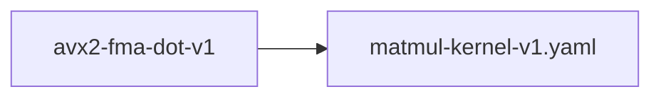

# avx2-fma-dot-v1

**Version:** 1.0.0

AVX2+FMA dot product — zero-alloc, fused multiply-add for decoder matmul hot path

## References

- Intel 64 and IA-32 Architectures Optimization Reference Manual — Section 11.6 FMA
- Agner Fog (2024) Instruction Tables — vfmadd231ps: 4-5c latency, 0.5c throughput

## Dependencies

- [matmul-kernel-v1.yaml](matmul-kernel-v1.yaml.md)

## Dependency Graph

## Equations

### dot_product

$$
dot(a, b) = \sum_{i=0}^{n-1} a_i · b_i
$$

**Domain:** $a, b \in \mathbb{R}^n (f32)$

**Codomain:** $\mathbb{R} (f32)$

**Invariants:**

- $dot(a, b) = dot(b, a) (commutativity)$
- $dot(\alpha·a, b) = \alpha·dot(a, b) (linearity)$
- $dot(a, a) \geq 0 (non-negativity of self-dot)$

### fma_accumulation

$$
acc_k = fma(a_k, b_k, acc_{k-1}) where fma(x,y,z) = RN(x·y+z)
$$

**Domain:** $a_k, b_k \in f32, acc_0 = 0$

**Codomain:** $f32$

**Invariants:**

- $FMA rounds once (not twice as mul+add would)$
- $4 independent accumulators hide pipeline latency$
- $|fma_dot - scalar_dot| \leq n · \varepsilon_mach (different rounding, bounded error)$

## Proof Obligations

| # | Type | Property | Formal |
|---|------|----------|--------|
| 1 | equivalence | SIMD matches scalar | $\|dot_fma_avx2(a, b) - dot_scalar(a, b)\| < tolerance$ |
| 2 | invariant | Zero-allocation | $dot_fma_avx2 performs 0 heap allocations$ |
| 3 | invariant | Commutativity | $\|dot(a, b) - dot(b, a)\| < \varepsilon$ |
| 4 | bound | Self-dot non-negative | $dot(a, a) \geq 0 for all a$ |
| 5 | invariant | Empty input returns zero | $dot([], []) = 0.0$ |

## Kernel Phases

1. **avx2_fma_loop**: Process 32 elements per iteration using 4 independent FMA accumulators — *Each accumulator covers non-overlapping 8-element lanes*
2. **horizontal_reduce**: Reduce 4 __m256 accumulators to scalar via hadd + extract — *All 32 partial sums included exactly once*
3. **scalar_tail**: Process remaining n % 32 elements with scalar multiply-add — *Tail elements processed exactly once*

## Falsification Tests

| ID | Rule | Prediction | If Fails |
|----|------|------------|----------|
| FALSIFY-DOT-001 | Scalar equivalence | \|dot_fma_avx2(a, b) - scalar_dot(a, b)\| < 4 ULP for all valid f32 | FMA accumulation order error or missing tail handling |
| FALSIFY-DOT-002 | Empty and unit | dot([], []) = 0.0 and dot([x], [y]) = x*y | Missing base case |
| FALSIFY-DOT-003 | Dimension match for decoder | dot_fma_avx2 matches scalar for d_model=384 and d_ff=1536 | Alignment or remainder handling error at d_model boundary |
| FALSIFY-DOT-004 | Commutativity | dot(a, b) = dot(b, a) within 1 ULP | Asymmetric accumulation order |
| FALSIFY-DOT-005 | NaN propagation | dot([NaN, 1.0], [1.0, 1.0]) = NaN | NaN silently dropped in SIMD lane |

