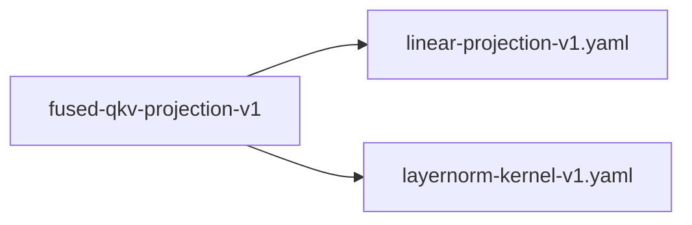

# fused-qkv-projection-v1

**Version:** 1.0.0

Fused QKV projection — concatenated weight matrix for single-matvec attention projection

## References

- Vaswani et al. (2017) Attention Is All You Need
- Whisper decoder: pre-norm transformer with separate Q/K/V weight matrices

## Dependencies

- [linear-projection-v1.yaml](linear-projection-v1.yaml.md)
- [layernorm-kernel-v1.yaml](layernorm-kernel-v1.yaml.md)

## Dependency Graph

## Equations

### fused_qkv

$$
Fused (1 matvec with concatenated weights):
  W_qkv = [W_q; W_k; W_v]   \in \mathbb{R}^{3·d_model × d_model}
  b_qkv = [b_q; b_k; b_v]   \in \mathbb{R}^{3·d_model}
  normed = LayerNorm(x)
  qkv = W_qkv @ normed + b_qkv    (d_model \to 3·d_model)
  q = qkv[0..d_model]
  k = qkv[d_model..2·d_model]
  v = qkv[2·d_model..3·d_model]

$$

**Domain:** $x \in \mathbb{R}^{d_model}$

**Codomain:** $q, k, v \in \mathbb{R}^{d_model} (sliced from \mathbb{R}^{3·d_model})$

**Invariants:**

- $W_qkv rows [0..d) = W_q rows, [d..2d) = W_k rows, [2d..3d) = W_v rows$
- $Contiguous memory layout for prefetch-friendly sequential access$

### separate_qkv

$$
Standard (3 separate matvecs):
  normed = LayerNorm(x)
  q = W_q @ normed + b_q    (d_model \to d_model)
  k = W_k @ normed + b_k    (d_model \to d_model)
  v = W_v @ normed + b_v    (d_model \to d_model)

$$

**Domain:** $x \in \mathbb{R}^{d_model}$

**Codomain:** $q, k, v \in \mathbb{R}^{d_model}$

## Proof Obligations

| # | Type | Property | Formal |
|---|------|----------|--------|
| 1 | equivalence | Fused matches separate QKV | $\|fused_qkv(x) - separate_qkv(x)\| < \varepsilon element-wise$ |
| 2 | invariant | Output dimension correct | $len(qkv) = 3 * d_model$ |
| 3 | invariant | Weight concatenation preserves values | $W_qkv[i*d..(i+1)*d, :] = W_i for i \in {q,k,v}$ |
| 4 | invariant | Bias concatenation preserves values | $b_qkv[i*d..(i+1)*d] = b_i for i \in {q,k,v}$ |
| 5 | invariant | Single matvec call | $Exactly one tiled_matvec_f16_into call for Q+K+V combined$ |

## Kernel Phases

1. **weight_fusion**: At load time: concatenate W_q, W_k, W_v into contiguous W_qkv — *W_qkv layout matches concatenation spec*
2. **projection**: At inference: single matvec producing 3·d_model output, then slice — *q = qkv[0..d], k = qkv[d..2d], v = qkv[2d..3d]*

## Falsification Tests

| ID | Rule | Prediction | If Fails |
|----|------|------------|----------|
| FALSIFY-QKV-001 | Equivalence to separate projections | \|fused_qkv(x) - [w_q@x; w_k@x; w_v@x]\| < 1e-6 element-wise | Weight concatenation order or slicing error |
| FALSIFY-QKV-002 | Weight layout verification | W_qkv[0..d*d] = W_q.flatten(), W_qkv[d*d..2*d*d] = W_k.flatten() | Row-major vs column-major confusion in concatenation |
| FALSIFY-QKV-003 | Bias correctness | b_qkv[0..d] = b_q, b_qkv[d..2d] = b_k, b_qkv[2d..3d] = b_v | Bias vector ordering error |
| FALSIFY-QKV-004 | Whisper-specific dimensions | Correct for d_model ∈ {384, 512, 768, 1024, 1280} | Dimension-specific edge case |

